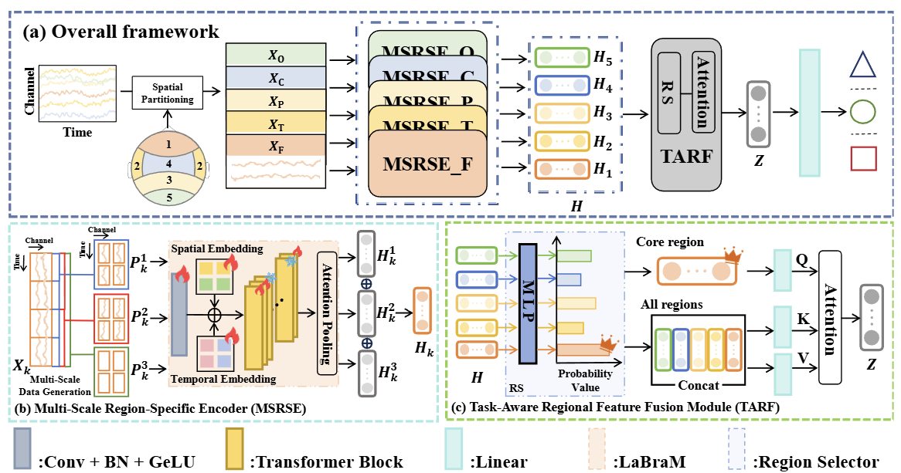
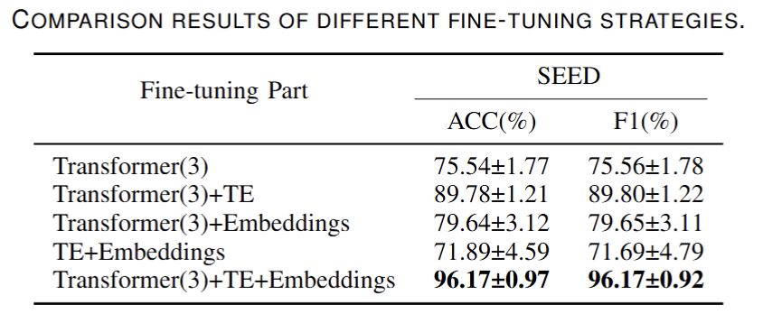
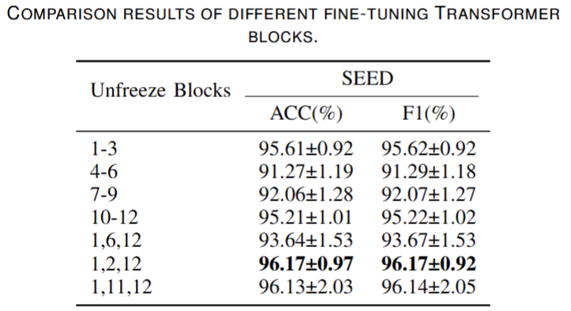
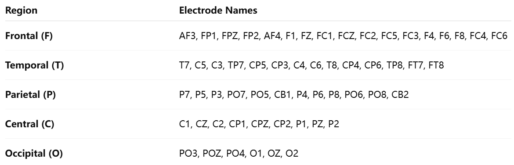

# Multi-Scale Task-Aware EEG Representation Learning for Cognitive State Recognition

## Abstract
Electroencephalography (EEG) has become an important tool for cognitive state assessment. Although deep learning methods have achieved remarkable progress in this area, most existing approaches overlook the heterogeneous encoding patterns across different brain regions and the multi-scale dynamics of neural activity, which limits the reliability and generalization of EEG representations. To address this issue, we propose MSTA-EEGNet, a multi-scale task-aware network for EEG-based cognitive state recognition. In this framework, EEG channels are partitioned into multiple functional regions, with independent encoders assigned to each region to capture distinct neural patterns. A multi-scale feature extraction strategy is further introduced to model neural dynamics across different time resolutions. Furthermore, a task-aware regional feature fusion module is designed to adaptively emphasize task-relevant regions and guide cross-region feature integration, thereby enhancing task-specific representations. Extensive experiments on emotion recognition, workload assessment, and motor imagery demonstrate that MSTA-EEGNet consistently outperforms representative state-of-the-art methods.
## 2. Method Overview

 The model begins with signal splitting, where EEG channels are partitioned into five functional regions. Each region is then processed by a dedicated multi-scale encoder to capture region-specific representations at multiple temporal resolutions. Finally, a task-aware regional feature fusion module integrates features across regions, adaptively highlighting task-relevant brain areas to generate discriminative representations for cognitive state recognition.

## 3.Training Model
After entering the folder and set your own parameters and folder paths , you can run
```
python main.py 
```
to train the model by youself.

## 4.Additional Explanation

### Ablation on Fine-Tuning Strategies:


To identify optimal LaBraM fine-tuning strategies, we conducted extensive experiments on the SEED dataset.  The ablation results for the finetuning part are shown in the table above, where "Transformer" indicates fine-tuning transformer blocks with numbers in parentheses representing the count of modified blocks, "TE" refers to temporal encoder, and "Embeddings" includes both temporal and spatial embeddings.


As shown in the table above, when fine-tuning TE and embeddings simultaneously, we performed ablation experiments on the number of fine-tuned transformer blocks. With increasing block numbers, parameter quantities exponentially grow, but model performance improvements become marginal. Considering training and testing efficiency, we believe sacrificing certain performance for smaller parameter sizes is acceptable. Therefore, we choose to fine-tune three transformer blocks.



To determine which blocks require fine-tuning, we also conducted extensive experiments, the results are shown in the table above. Based on experimental results, the final selection fine-tunes blocks 1, 2, and 12. Block 1 is fine-tuned to enable the model to adapt to new channel ranges and scale representations, while block 12 is optimized to ensure output features meet downstream feature fusion requirements. 
###  Channel to region mapping:

The figure above is the region-electrode correspondence table we used, which can be adjusted as needed when there are variations in equipment or data quality.

###  MMD Values:
On the SEED dataset, the MMD values for the frontal (F), temporal (T), parietal (P), central (C), and occipital (O) regions are 0.23, 0.08, 0.13, 0.04, and 0.18, respectively. On the PWED dataset, the corresponding MMD values are 0.18, 0.04, 0.01, 0.05, and 0.21, while on the BCIC IV-1 dataset, they are 0.16, 0.03, 0.22, 0.29, and 0.03.

###  Preprocessing:
All datasets were downsampled to 200Hz before the experiment, filtered between 0-75Hz, and a 50Hz notch filter was applied to remove power line noise. Finally, ICA artifact correction was performed.
## Citation
Please cite our paper if the code should be useful for you.
```

```
